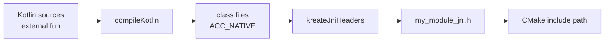

# Header generation

<link-summary>
Generating C++ declarations from your Kotlin external functions, and why it matters.
</link-summary>

<card-summary>
The C++ compiler cannot check a JNI symbol name — unless you generate the header. Here is how.
</card-summary>

<tldr>
<p><b>Task</b>: <code>kreateJniHeaders</code></p>
<p><b>Output</b>: <code>build/generated/jni/include/&lt;name&gt;_jni.h</code></p>
<p><b>Default</b>: on, once JNI is enabled</p>
</tldr>

## The problem it solves

A JNI function is found by name at runtime. The name is derived mechanically from the class and
method, mangled according to rules in the JNI specification:

```kotlin
package com.example

class Native {
    external fun greet(): String
}
```

must be implemented as:

```c++
JNIEXPORT jstring JNICALL Java_com_example_Native_greet(JNIEnv*, jobject);
```

Nothing checks that correspondence. Rename the Kotlin class, move it to another package, add an
overload, or mistype a single underscore, and both sides still compile. The failure appears the
first time the function is called:

```
java.lang.UnsatisfiedLinkError: 'java.lang.String com.example.Native.greet()'
```

For Java, `javac -h` generates these declarations. **Kotlin has no equivalent** — `external`
declarations never pass through `javac`. That is why JNI signatures in Kotlin projects are
traditionally written by hand, and why they break.

## How %product% generates them

`kreateJniHeaders` reads the *compiled* class files of your JVM main source set, finds every
method carrying the `ACC_NATIVE` flag, and emits its declaration.

Working from bytecode rather than source matters: the bytecode is what the JVM will actually
look up, so the generated name is correct by construction — including for anything the Kotlin
compiler renamed on its way down.



## Using the generated header

Include it from your C++ sources. The CMake include path is configured automatically, so no
relative path is needed:

```c++
#include "my_module_jni.h"

JNIEXPORT jstring JNICALL
Java_com_example_Native_greet(JNIEnv* env, jobject receiver) {
    return env->NewStringUTF("Hello from C++");
}
```

With the header included, a mismatch between your definition and what the JVM expects becomes a
**compile error** instead of a runtime one.

<tip>
This is the entire point of the feature. Generating the header and then not including it gives
you a nice document and no safety. Include it.
</tip>

## What the generated header looks like

<code-block lang="c++" collapsible="true" collapsed-title="build/generated/jni/include/my_module_jni.h">
/* This file is generated by Kreate. Do not edit — it is overwritten on every build. */
#ifndef MY_MODULE_JNI_H
#define MY_MODULE_JNI_H

#include &lt;jni.h&gt;

#ifdef __cplusplus
extern "C" {
#endif

/*
 * Class:     com.example.Native
 * Method:    greet
 * Signature: ()Ljava/lang/String;
 */
JNIEXPORT jstring JNICALL Java_com_example_Native_greet
  (JNIEnv *env, jobject receiver);

#ifdef __cplusplus
}
#endif

#endif /* MY_MODULE_JNI_H */
</code-block>

Each declaration carries the originating class, method, and JVM descriptor as a comment, so you
can trace a symbol back to its Kotlin declaration without decoding the mangling yourself.

## Type mapping

Kotlin and Java types are mapped to their JNI counterparts exactly as the specification requires.

<table>
    <tr><td>Kotlin</td><td>Descriptor</td><td>JNI type</td></tr>
    <tr><td><code>Boolean</code></td><td><code>Z</code></td><td><code>jboolean</code></td></tr>
    <tr><td><code>Byte</code></td><td><code>B</code></td><td><code>jbyte</code></td></tr>
    <tr><td><code>Char</code></td><td><code>C</code></td><td><code>jchar</code></td></tr>
    <tr><td><code>Short</code></td><td><code>S</code></td><td><code>jshort</code></td></tr>
    <tr><td><code>Int</code></td><td><code>I</code></td><td><code>jint</code></td></tr>
    <tr><td><code>Long</code></td><td><code>J</code></td><td><code>jlong</code></td></tr>
    <tr><td><code>Float</code></td><td><code>F</code></td><td><code>jfloat</code></td></tr>
    <tr><td><code>Double</code></td><td><code>D</code></td><td><code>jdouble</code></td></tr>
    <tr><td><code>Unit</code></td><td><code>V</code></td><td><code>void</code></td></tr>
    <tr><td><code>String</code></td><td><code>Ljava/lang/String;</code></td><td><code>jstring</code></td></tr>
    <tr><td><code>IntArray</code></td><td><code>[I</code></td><td><code>jintArray</code></td></tr>
    <tr><td><code>Array&lt;String&gt;</code></td><td><code>[Ljava/lang/String;</code></td><td><code>jobjectArray</code></td></tr>
    <tr><td>Any other class</td><td><code>L…;</code></td><td><code>jobject</code></td></tr>
</table>

The second parameter is a `jobject` receiver for instance methods and a `jclass` for methods in
a companion object or otherwise compiled as static.

## Overloaded native functions

When a name is unique within its class, the short form is used. When it is overloaded, the JNI
requires the argument signature to be appended, and %product% emits the long form for **every**
overload of that name:

```kotlin
external fun compute(value: Int): Int
external fun compute(value: Long): Int
```

```c++
JNIEXPORT jint JNICALL Java_com_example_Native_compute__I  (JNIEnv *env, jobject receiver, jint arg1);
JNIEXPORT jint JNICALL Java_com_example_Native_compute__J  (JNIEnv *env, jobject receiver, jlong arg1);
```

<note>
Special characters are escaped as the specification requires: <code>_</code> becomes
<code>_1</code>, <code>;</code> becomes <code>_2</code>, <code>[</code> becomes <code>_3</code>,
<code>/</code> becomes <code>_</code>, and anything non-ASCII becomes <code>_0xxxx</code>. Package
<code>a_b</code> and package <code>a.b</code> therefore do not collide.
</note>

## Configuration

```kotlin
kreate {
    platform {
        jvm {
            jni {
                enabled = true

                headers {
                    enabled = true
                    fileName = "my_bindings.h"
                }
            }
        }
    }
}
```

<deflist type="medium">
    <def title="enabled">
        Whether headers are generated. Defaults to <code>true</code>. Turn it off only if you
        maintain the declarations yourself and accept the consequences.
    </def>
    <def title="fileName">
        The generated file name. Defaults to <code>&lt;projectName&gt;_jni.h</code>.
    </def>
</deflist>

## Ordering

Header generation depends on compiled classes, so the pipeline runs **after** Kotlin compilation.
This is the reason the native build is not wired into `compileKotlin`: doing so would create a
cycle, since the headers cannot exist before the classes do.

Nothing on the JVM side needs the shared library until code is executed, so the library is built
before `test`, `run`, and `jar` instead — which is also faster, because an ordinary Kotlin
compile no longer drags a native build along with it.

<seealso>
    <category ref="native">
        <a href="JNI-Support.md">JNI support</a>
        <a href="JNI-Build-Pipeline.md">Build pipeline</a>
        <a href="JNI-Troubleshooting.md">Troubleshooting</a>
    </category>
    <category ref="external">
        <a href="https://docs.oracle.com/en/java/javase/21/docs/specs/jni/design.html#resolving-native-method-names">JNI: resolving native method names</a>
    </category>
</seealso>
